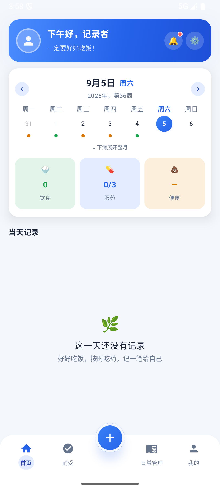
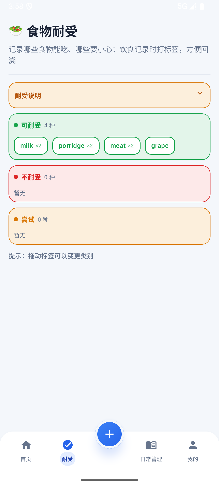
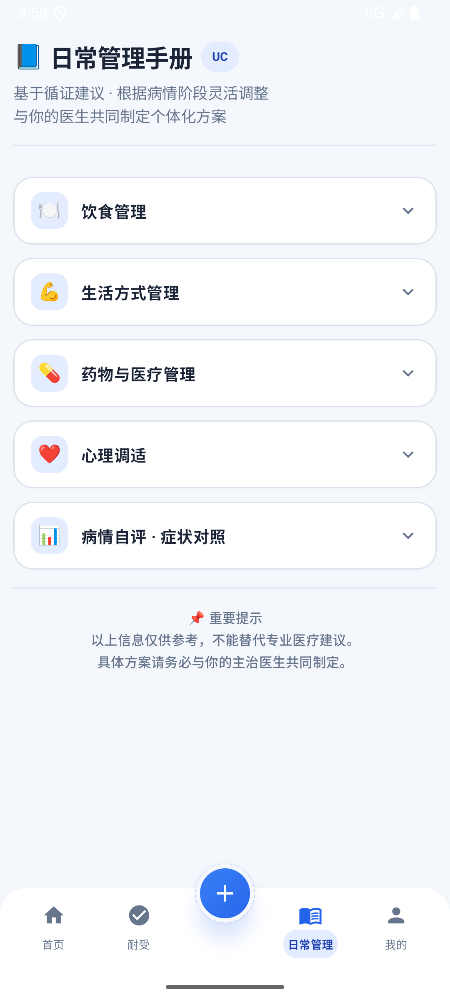
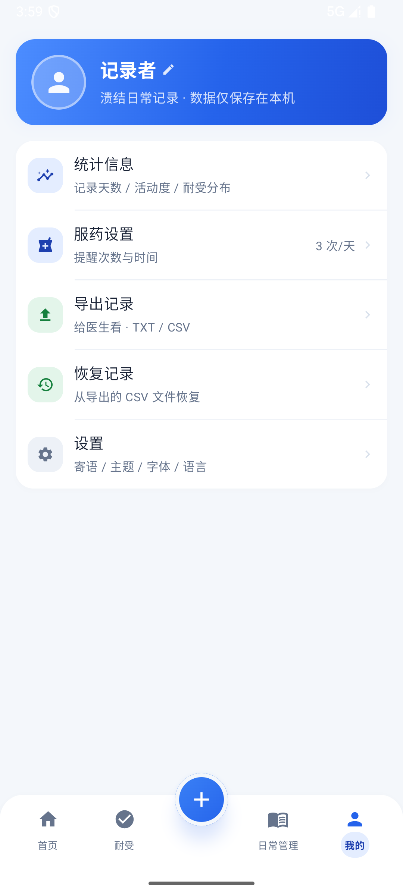

<div align="center">

# 溃结日常记录 · UC Daily

**溃疡性结肠炎（UC）日常记录 Android 应用**

每天把吃的、拉的、吃的药、身体的感受都记下来，方便回溯"症状出现前吃了什么"，也方便复诊时给医生看。

</div>

> 📄 **English version**：[README.md](./README.md)
>
> 📦 **APK 下载**（最新 release，打 `v*` tag 后由 GitHub Actions 自动编译更新）：[uc-daily.apk](https://github.com/hualayn/uc-daily/releases/latest/download/uc-daily.apk)

---

## 界面截图

<table>
  <tr>
    <td align="center" width="50%"></td>
    <td align="center" width="50%"></td>
  </tr>
  <tr>
    <td align="center"><b>首页</b><br>日历（周 / 整月）· 当日统计 · 当天记录</td>
    <td align="center"><b>耐受</b><br>食物耐受：可耐受 / 尝试 / 不耐受</td>
  </tr>
  <tr>
    <td align="center" width="50%"></td>
    <td align="center" width="50%"></td>
  </tr>
  <tr>
    <td align="center"><b>日常管理</b><br>循证管理手册 · 病情自评</td>
    <td align="center"><b>我的</b><br>统计信息 · 导出 / 恢复 · 设置</td>
  </tr>
</table>

## 这个应用是做什么的

为与溃疡性结肠炎（溃结）共处的人打造，它帮助你：

- **找出诱因。** 每餐都记录（照片 + 食物标签）。发作时回看之前的几天，看看吃过什么。**耐受**页维护"能吃什么 / 可以尝试什么 / 要避开什么"的清单，每个食物显示被饮食记录打标签的次数，问题食物一目了然。
- **监测病情活动度。** 每条排便记录按简化版患者自评 UCDAI 自动打分，日历上用颜色圆点展示：🟢 缓解 · 🟡 轻度 · 🟠 中度 · 🔴 重度。
- **不漏服药物。** 设置每天的提醒次数与时间。漏服时首页铃铛变红点，并弹出系统通知。
- **给医生看真实数据。** 按日期区间导出 TXT / CSV，复诊时直接给医生。
- **数据完全私密。** 所有数据只存在本机（本地 Room 数据库 + 应用私有照片存储），无账号、无云端、不联网。

> ⚠️ 活动度评分与日常管理手册仅供自我监测与参考，**不能**替代医生诊断。

## 各页面介绍

四个底部 Tab + 中间凸起 **"+"** 按钮（任何 Tab 都能打开快捷添加面板：🍚 饮食 · 💩 大便 · 💊 服药 · 📝 笔记）。

### 🏠 首页

- **欢迎卡**：头像 + 按时段问候 + 暖心横幅（按日期每天轮播"首页寄语"列表中一条，列表可在"我的 → 设置 → 首页寄语"逐条修改 / 添加 / 删除）；右上角服药提醒铃铛（提醒时间已到但未记录服药时亮红点，点击回到今天并打开添加服药面板；同时系统发出红色通知提醒）
- **今日卡**：日期头（左右箭头换周 / 换月）+ 日历，默认周视图（左右滑动换周，点击选日，有排便记录的日子按活动度着色）；**下滑展开整月视图**（上滑收起；整月视图下左右滑动 / 箭头换月）
- **当日统计**：饮食次数 / 便便次数 / 服药次数 · 总次数；点击统计卡可按类别筛选当天记录，再点一次或点"恢复"取消筛选
- **当天记录**：排便 / 饮食 / 服药按时间顺序混排（今日感受置顶）；首页点卡片选中（单选）后出现编辑 / 删除按钮

### 🍽️ 耐受

- 管理食物耐受状态：**可耐受（绿）** / **尝试（黄）** / **不耐受（红）**；食物在"添加饮食"页添加（添加时选择初始状态）
- 点 tag 出现 **X** 角标可删除；长按 tag（按住 400ms）拖动：同分区内松开 = 调整顺序，拖到另一分区松开 = 改变耐受状态
- 展示每个食物被饮食记录引用（打标签）的次数，方便找出问题食物

### 📖 日常管理

- 日常管理手册（手风琴卡片，互斥展开，默认展开"饮食管理"）：**饮食管理** / **生活方式管理** / **药物与医疗管理** / **心理调适** / **病情自评 · 症状对照**
- **病情自评**：发作期 / 缓解期典型症状对照 + 简易活动性评分（排便次数、便血、腹痛、体温四题，总分 0~11 → 缓解 / 轻度 / 中度 / 重度活动）
- 循证参考信息，仅供自我参考，不替代医生诊断

### 👤 我的

- 头像（通用 / 男生 / 女生）与昵称（可修改）
- 菜单：
  - **统计信息**：记录天数 / 饮食条数 / 排便天数 / 服药条数、活动度分布、食物耐受分布；点击数量块打开该类型的全时段记录明细（年 → 月 → 日层级）
  - **服药设置**：设置每天服药提醒次数与提醒时间（驱动首页铃铛 + 系统通知）；含"准时提醒（精确闹钟）"权限状态卡，未授权时直达系统授权页
  - **导出记录**：选日期区间 + 记录类型（饮食 / 服药 / 便便 / 感受），输出 TXT / CSV（CSV 附带全部食物耐受），保存剪切板或文件
  - **恢复记录**：选择「导出记录」生成的 CSV 文件即可恢复日常记录与食物耐受（同日期同内容的记录自动跳过，每日感受按日期覆盖，食物耐受按名称更新或新增）
  - **设置**：二级页，含 **首页寄语**（管理欢迎卡轮播寄语列表：逐条修改 / 添加 / 删除 / 恢复默认 8 条）· **主题**（浅色 / 深色 / 跟随系统）· **字体大小** · **语言**（12 个选项，切换后立即生效，见"多语言"）· **软件更新**（Google Play Core，见"多语言"）· **关于**

## 功能

- **饮食记录**：早餐 / 午餐 / 晚餐 / 加餐，一天可记多条；相机拍摄或相册多选（单次最多 9 张），一条记录可加多张照片；文字备注 + 食物标签（在"耐受"页维护，记录时可多选）
- **排便记录**：一天可记多条（每次记录一条，按时间排序），记录排便次数、夜间腹泻、大便性状（布里斯托分级 1~7）、便血、黏液、腹痛（0~10 分 + 部位）、急迫感、其他不适；补录历史日期可调整记录时间
- **活动度评分**：按简化 UCDAI 患者自评口径（排便次数 0~4 + 便血 0~4）自动算 0~8 分，分为缓解 / 轻度 / 中度 / 重度活动，驱动日历圆点与记录卡片展示（仅供自我监测参考，不替代医生诊断）
- **服药记录**：药名（含常用药快捷选择，长按标签可删除该快捷标签）+ 剂量，一天可记多条，支持编辑 / 删除
- **服药提醒**：在"我的 → 服药设置"设置提醒次数 / 时间；判定口径为"已到点的提醒时间数 > 当天服药记录数"即视为未服药。未服药时：首页铃铛亮红点（点击直达添加服药）+ 系统通知（状态栏常驻红色图标 / 应用图标角标，文案"您还有 N 次未服药，请尽快服药！"）。到点触发由系统精确闹钟（AlarmManager）驱动——应用处于后台 / 被系统杀掉时到点同样提醒，重启后自动重注册；需要通知权限（Android 13+ 启动时运行时申请）与精确闹钟权限（Android 12+，服药设置页有授权入口）
- **今日感受**：每天一条自由文本（排便、睡眠、心情、不适…），补录历史日期同样支持
- **记录导出**：TXT / CSV，按日期区间与记录类型筛选，输出到剪切板或文件，方便复诊时给医生看
- **编辑 / 删除**：所有记录卡片均可编辑（二次确认删除）
- **全屏查看**：点照片可放大查看（多张可左右滑动）
- **日期回溯**：首页周历 / 整月视图可点选任意日期，查看 / 补录当天记录
- **主题**：浅色 / 深色 / 跟随系统（"我的 → 设置 → 主题"切换）
- **多语言**：默认跟随系统语言，可在"我的 → 设置 → 语言"手动切换 12 个选项（跟随系统 / 简体中文 / English / 日本語 / 한국어 / Français / Deutsch / Italiano / Español / Português / Русский / العربية）；应用界面、服药提醒通知与通知渠道文案随所选语言显示；阿拉伯语自动启用 RTL 布局
- **应用内更新**：集成 Google Play Core（app-update 2.x）Flexible 应用内更新——启动时静默检查新版本，"我的 → 设置 → 软件更新"可手动检查；发现新版本 → "立即更新" → 后台下载 → "立即重启"生效

## 技术栈

- **Kotlin** 2.2.10 / **AGP** 9.3.0 / **Gradle** 9.5.0
- **Jetpack Compose** + Material3（底部 NavigationBar 四 Tab + 中央快捷添加；记录面板为全局浮层，任何 Tab 都能打开）
- **Room** 2.7.1（本地 SQLite，全新数据库 schema，版本 1）
- **Coil** 2.7.0（图片加载）
- **MVVM** 架构（ViewModel + StateFlow）
- **Google Play Core**（`com.google.android.play:app-update:2.1.0`）：应用内 Flexible 更新（多语言版本更新下发）

## 多语言

- **文案资源**：全部界面文案集中在 `app/src/main/res/values*/strings.xml`（默认简体中文 + 10 个语言目录：`values-en` / `values-ja` / `values-ko` / `values-fr` / `values-de` / `values-it` / `values-es` / `values-pt` / `values-ru` / `values-ar`）；代码中通过 `stringResource(R.string.x)` / `context.getString(...)` 读取，枚举/列表类文案（餐次、耐受状态、布里斯托便级、便血、腹痛部位、活动度、主题、字体档位、星期等）以 `@StringRes` 资源 id 形式定义
- **语言切换**：`AppLocale`（`app/src/main/java/com/ucdaily/AppLocale.kt`）负责语言选项与持久化（SharedPreferences `app_prefs / app_language`，默认"跟随系统"）；`UcDailyApp` 与 `MainActivity` 在 `attachBaseContext` 中按所选语言包装上下文，切换后 `Activity.recreate()` 即时生效。应用级本地化保证后台（闹钟 / 开机广播 / 服务）发出的服药提醒通知也随语言显示
- **版本分发（Google Play Core）**：语言资源随 App Bundle（AAB）一起打包，通过 Google Play 的"仅下发与用户相关的语言"能力按设备语言分发，用户无需安装多余语言包；新增语言 / 功能的新版本经 Google Play 推送，应用内通过 Play Core 检查并 Flexible 更新（启动时静默检查 + "我的 → 设置 → 软件更新"手动检查 → 后台下载 → 重启生效）。注意：应用内更新仅对从 Google Play 安装的版本生效，侧载包检查会静默降级
- **上架建议**：在 Play Console 中发布 AAB 时勾选"仅向用户提供相关语言"以启用按语言分发；如需阿拉伯语正确从右到左展示，请保留 Manifest 中的 `android:supportsRtl="true"`

## 系统要求

- Android SDK 26+（Android 8.0）
- JDK 17+（构建时 Gradle toolchain 会自动下载所需 JDK）
- Android Studio Iguana+

## 构建

```bash
# 仓库根目录
./gradlew assembleDebug        # Windows: gradlew.bat assembleDebug
```

构建产物位于 `app/build/outputs/apk/debug/`。

## 项目结构

```
app/src/main/java/com/ucdaily/
├── UcDailyApp.kt         # Application：按所选语言应用资源（默认跟随系统）
├── AppLocale.kt          # 多语言：语言选项、持久化、attachBaseContext 本地化包装
├── MainActivity.kt       # 入口：底部 Tab 编排、相机/相册 Activity 启动器、全局面板层、应用内更新 UI
├── MedReminder.kt        # 服药提醒：系统通知发出/取消 + 系统闹钟安排 + 闹钟/开机广播接收器（后台可用）
├── MedReminderService.kt # 服药提醒服务（提醒同步协程作用域）
├── play/
│   └── AppUpdate.kt      # Google Play Core 应用内更新（Flexible）：检查 / 下载 / 重启
├── ui/
│   ├── MealLogViewModel.kt      # ViewModel：状态管理（单一 MealUiState）、草稿、数据操作
│   ├── HomeScreen.kt            # 首页：欢迎卡（服药铃铛）、日历（周/整月）、当日统计、当天记录
│   ├── ToleranceScreen.kt       # 耐受 Tab：食物耐受管理（点删 / 拖动排序 / 跨分区改状态）
│   ├── DailyManagementScreen.kt # 日常管理 Tab：管理手册（手风琴卡片）+ 病情自评分
│   ├── ProfileScreen.kt         # 我的 Tab：头像/昵称 + 菜单（统计/服药设置/导出/恢复/设置）
│   ├── SettingsScreen.kt        # 设置页：首页寄语 / 主题 / 字体大小 / 语言 / 软件更新 / 关于
│   ├── HomeSloganScreen.kt      # 首页寄语页：横幅轮播寄语列表管理（逐条修改/添加/删除/恢复默认）
│   ├── StatsScreen.kt           # 统计页：记录量、活动度分布、食物耐受分布
│   ├── MedSettingsScreen.kt     # 服药设置页：提醒次数、提醒时间、精确闹钟权限卡
│   ├── RecordPanels.kt          # 全局记录面板：饮食/排便/服药/笔记面板、全屏照片查看
│   ├── RecordListScreen.kt      # 记录汇总列表：按类型（年 → 月 → 日层级，从统计页进入）
│   ├── MealLogScreen.kt         # 共用组件：饮食/排便记录卡片、导出对话框、星期/活动度工具
│   ├── DesignSystem.kt          # 设计系统：色板、卡片、按钮、角标、分区标题、顶栏
│   └── Theme.kt                 # 蓝色系主题（浅/深）
├── data/
│   ├── MealRecord.kt / MealRecordDao.kt     # 饮食记录实体 + 餐次枚举（食物标签 JSON 编解码）
│   ├── DailySymptom.kt / DailySymptomDao.kt # 排便/症状实体 + 活动度评分（简化 UCDAI）
│   ├── MedRecord.kt / MedRecordDao.kt       # 服药记录实体
│   ├── DailyNote.kt / DailyNoteDao.kt       # 每日感受实体（date 唯一）
│   ├── FoodTag.kt / FoodTagDao.kt           # 食物标签实体 + 耐受枚举（可耐受/尝试/不耐受）+ 排序键
│   ├── RestoreImporter.kt                   # CSV 恢复：解析本应用导出的格式
│   └── AppDatabase.kt                       # 数据库配置（版本 1，全新 schema，无历史迁移）
└── util/
    └── PhotoCompressor.kt      # 照片压缩（存储前 JPEG < 300KB）
```

## 数据存储说明

- 记录存于本地 Room 数据库 `uc_daily_db`（表 `meal_records` 饮食、`daily_symptoms` 排便、`med_records` 服药、`daily_notes` 感受、`food_tags` 食物标签；饮食 / 排便 / 服药每天可多条，排便含记录时间；感受按 date 唯一）
- 照片存于应用私有目录（`getExternalFilesDir`），卸载应用时自动清理
- 相册选取的照片会压缩（JPEG < 300KB）后复制到应用私有目录，保证卸载前一直可查看
- 偏好（昵称 / 头像 / 主题 / 字体大小 / 首页寄语 / 常用药 / 服药提醒时间）存 SharedPreferences
- 服药提醒：通知走系统通知渠道 `med_reminder`（常驻、可着色）；到点触发用系统精确闹钟（AlarmManager，最多 6 个提醒时间各占一个槽位），应用启动 / 修改提醒时间 / 开机完成时重注册

## 活动度评分说明

参考 UCDAI（溃疡性结肠炎疾病活动指数）中可由患者自评的部分（用于日常记录与日历着色）：

- 排便次数得分：≤4 次=0，5~6 次=1，7~10 次=2，11~14 次=3，≥15 次=4
- 便血得分：无=0，少量=1，明显=3，血块=4
- 总分 0~8：0=缓解（绿），1~3=轻度（黄），4~5=中度（橙），6~8=重度（红）

> 该评分仅供自我监测与就医参考，不能替代医生诊断。UCDAI 完整版还需医生评估（全身状况 + 病变范围）。
>
> 另："日常管理"页提供一套独立的简易自评（排便次数 / 便血 / 腹痛 / 体温四题，总分 0~11），用于快速对照当前所处阶段，与上述 UCDAI 口径不同，两者不要混用。
